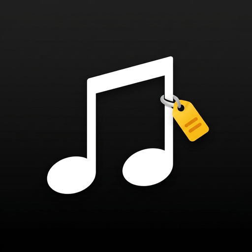
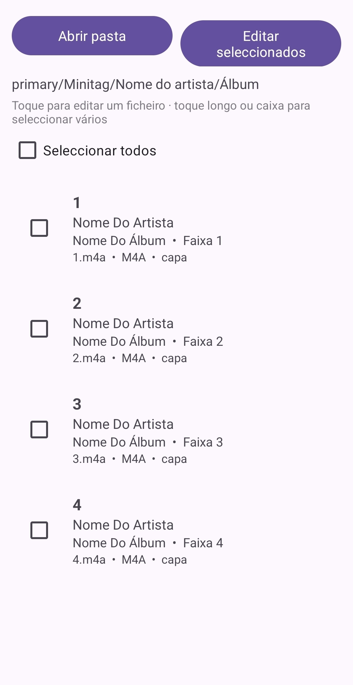
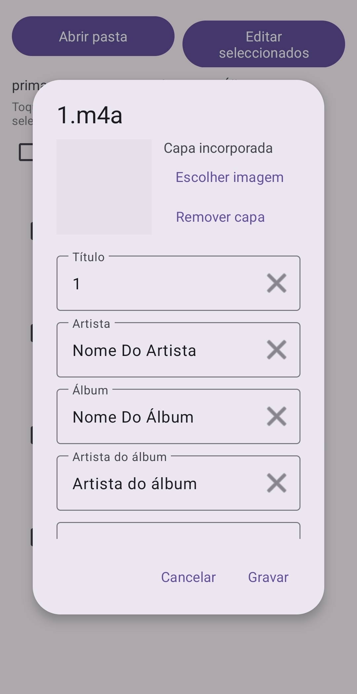
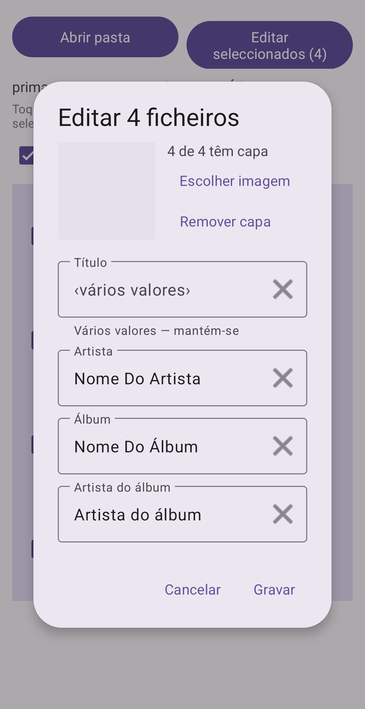

<p align="center">
  
</p>

<h1 align="center">MiniTag</h1>

<p align="center">
  Editor de metadados de áudio para Android, inspirado no Mp3tag.<br>
  Lê e grava tags directamente nos ficheiros, um a um ou em lote.
</p>

<p align="center">
  
  
  
  
  
</p>

> 🤖 **Aviso:** esta app foi desenvolvida com recurso a inteligência artificial. Ver [Desenvolvimento com IA](#desenvolvimento-com-ia).

---

## Funcionalidades

- **Edição individual** — toque num ficheiro para ver e alterar as tags actuais.
- **Edição em lote** — seleccione vários ficheiros (toque longo ou caixa) e edite-os de uma vez:
  - campos iguais em todos aparecem preenchidos;
  - campos diferentes mostram *‹vários valores›* e **mantêm-se** se não lhes tocar;
  - só o que alterar é gravado; o ✕ apaga um campo em todos os ficheiros.
- **Capa do álbum** — ver, substituir ou remover. Imagens WebP/HEIC são convertidas para JPEG.
- **Faixa e disco** no formato `3` ou `3/12` (número e total).
- **Ano** aceita ano simples (`2008`) ou data completa (`2008-06-23`).
- **Conversão para MP3** — converte os ficheiros seleccionados para MP3 (320, 256, 192, 128 kbps ou VBR), com tags e capa copiadas. Os MP3 são gravados numa subpasta `MP3/` junto de cada original, que nunca é alterado. Avisa quando o original já é um formato com perdas. A conversão continua em segundo plano, com notificação de progresso — pode usar outras apps entretanto.
- Lista com formato, bitrate, taxa de amostragem e duração de cada ficheiro.
- Pesquisa recursiva de subpastas e reabertura automática da última pasta.
- Detalhes completos de erro por ficheiro, com opção de copiar e repetir a leitura.
- Actualiza a biblioteca de música do Android após gravar, para os leitores verem logo as alterações.
- Ícone adaptativo com suporte a ícones temáticos (Android 13+).
- **Sem permissão de Internet** — tudo acontece no dispositivo.

### Permissões

| Permissão | Para quê |
|---|---|
| Acesso à pasta escolhida | Ler e gravar os ficheiros de música (pedido pelo Android ao abrir a pasta) |
| Notificações (Android 13+) | Mostrar o progresso da conversão para MP3 |
| Serviço em primeiro plano, manter o CPU acordado | Continuar a conversão com a app em segundo plano ou o ecrã desligado |

### Campos suportados

Título · Artista · Álbum · Artista do álbum · Compositor · Ano · Faixa · Disco · Género · Comentário · Capa

### Formatos suportados

| Formato | Extensões | Tipo de tag |
|---|---|---|
| MP3 | `.mp3` | ID3v2 (ID3v1 é lido e mantido sincronizado) |
| FLAC | `.flac` | Vorbis Comments + bloco PICTURE |
| Ogg Vorbis | `.ogg`, `.oga` | Vorbis Comments |
| MPEG-4 Audio | `.m4a` | MP4 (iTunes) |
| WAV | `.wav` | ID3 + LIST/INFO sincronizados |
| AIFF | `.aif`, `.aiff` | ID3 |
| WMA | `.wma` | ASF |
| DSF | `.dsf` | ID3 |

### Conversão para MP3

| Origem | Converte? |
|---|---|
| FLAC, WAV, AIFF, ALAC | ✅ sem perdas → MP3 |
| MP3, M4A (AAC), Ogg Vorbis | ✅ com aviso (formato com perdas) |
| M4A com AC-3/E-AC-3 | ⚠️ depende do telemóvel |
| WMA, DSF | ❌ o Android não os descodifica |

Ficheiros com o mesmo nome não são sobrescritos: é criado `nome (1).mp3`. Áudio 5.1 é misturado para estéreo; taxas acima de 48 kHz são reamostradas.

## Capturas de ecrã

<p align="center">
  
  
  
</p>

## Instalação

1. Descarregue o `MiniTag-v1.3-release.apk` na página de [Releases](../../releases).
2. Abra o ficheiro no telemóvel e autorize a instalação de fontes desconhecidas, se for pedido.

Requer **Android 8.0 (API 26)** ou superior.

## Utilização

1. **Abrir pasta** e escolha a pasta de música (o Android pede autorização de acesso uma vez).
2. **Toque** numa música para a editar, ou **toque longo** para seleccionar várias e use **Editar seleccionados**.
3. Altere os campos e carregue em **Gravar** — as alterações são escritas logo no ficheiro.
4. Para converter, seleccione ficheiros e use **Converter seleccionados para MP3**. Pode sair da app durante a conversão: o progresso fica na notificação, com botão para cancelar. No Android 13+ a app pede autorização para mostrar essa notificação.

> **Nota:** a partir do Android 11 o sistema não permite escolher a raiz do armazenamento nem a pasta *Download* completa. Escolha uma subpasta (ex.: `Music`).

## Limitações conhecidas

- **AAC (`.aac`) e Opus (`.opus`)** ainda não são suportados.
- Para ler/gravar, cada ficheiro é copiado temporariamente para a cache da app (exigência do jaudiotagger), o que torna mais lentas pastas com ficheiros muito grandes (ex.: FLAC de alta resolução).
- A conversão para MP3 usa um codificador em Java puro: é mais lenta do que numa app com código nativo (vários ficheiros são convertidos em paralelo para compensar). Para medir a velocidade real use o APK de *release* — o de *debug* é bastante mais lento.
- Campos com vários valores (ex.: vários artistas) são mostrados e gravados como um único valor.

## Compilar a partir do código

Requisitos: Android Studio (recente) com JDK 17.

```bash
git clone https://github.com/ToshGate/Minitag.git
cd Minitag
./gradlew assembleDebug
```

### APK de release assinado

1. Criar uma keystore (uma única vez — **guarde-a e às passwords em local seguro**; sem ela não é possível publicar actualizações):
   ```bash
   keytool -genkeypair -v -keystore minitag-release.jks -alias minitag -keyalg RSA -keysize 4096 -validity 10000
   ```
2. Copiar `keystore.properties.example` para `keystore.properties` e preencher.
3. Compilar:
   ```bash
   ./gradlew assembleRelease
   ```
   O APK fica em `app/build/outputs/apk/release/MiniTag-v1.3-release.apk`.

`keystore.properties` e `*.jks` estão no `.gitignore` e nunca devem ser publicados.

## Estrutura do projecto

| Ficheiro | Função |
|---|---|
| `TagEngine.kt` | Lógica de tags pura JVM (jaudiotagger), sem dependências Android — testável fora do telemóvel |
| `TagRepository.kt` | Ponte entre o Storage Access Framework e o `TagEngine` (cópia temporária, escrita segura, MediaStore) |
| `ConversionService.kt` | Serviço em primeiro plano que corre a conversão, com notificação e cancelamento |
| `ConversionManager.kt` | Estado da conversão partilhado entre o serviço e o ecrã |
| `AudioConverter.kt` | Conversão para MP3: descodificação com `MediaCodec`, pastas `MP3/` e nomes únicos |
| `Mp3Encoder.kt` | Codificador MP3 (núcleo do LAME/jump3r), sem dependências Android |
| `EditDialog.kt` | Diálogo de edição para 1 ou N ficheiros |
| `MainActivity.kt` | Lista, selecção, leitura e gravação em segundo plano |
| `TrackAdapter.kt` | Linhas da lista |

## Desenvolvimento com IA

O MiniTag foi desenvolvido com recurso a ferramentas de inteligência artificial:

- **Código e documentação** — escritos com a assistência do Claude (Anthropic).
- **Ícone** — gerado com o Gemini (Google) e adaptado para ícone Android.

A app foi testada num dispositivo Android real, mas pode conter erros que passaram despercebidos. **Faça cópia de segurança dos seus ficheiros de música antes de editar muitos de uma vez.** Relatos de problemas são bem-vindos em [Issues](../../issues).

## Bibliotecas

- [jaudiotagger](https://bitbucket.org/ijabz/jaudiotagger) 3.0.1 — LGPL-2.1 (ver [`THIRD_PARTY_NOTICES.md`](THIRD_PARTY_NOTICES.md))
- [jump3r](https://git.iem.at/sciss/jump3r) 1.0.5 (LAME em Java) — LGPL-2.1+
- AndroidX e Material Components — Apache-2.0

## Histórico de versões

Ver [`CHANGELOG.md`](CHANGELOG.md).

## Licença

Distribuído sob a licença **MIT** — ver [`LICENSE`](LICENSE).

Pode usar, copiar, modificar e distribuir o código, inclusive em projectos comerciais ou fechados, desde que mantenha o aviso de copyright e a licença. O software é fornecido **"tal como está", sem qualquer garantia**, e os autores não são responsáveis por danos resultantes da sua utilização.

As bibliotecas de terceiros mantêm as suas próprias licenças (ver [`THIRD_PARTY_NOTICES.md`](THIRD_PARTY_NOTICES.md)).
